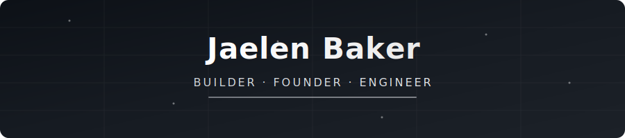

 

 
All of my projects are available in my repository.

I specialize in building full-stack AI systems and automation workflows, with experience across technologies such as N8N, ReactJS, VueJS, NextJS, and FastAPI.

My work focuses on designing and deploying scalable, real-time applications with sub-second performance, as well as developing autonomous AI agents for practical, production-level use cases.

Background in Mathematics and Computer Science, based in Santa Clara.

## Tech Stack

**Languages** 

**Build With** 

**AI / ML** 

**Infrastructure** 

**Building something interesting? [Let's talk.](jaelenbaker101@gmail.com)**

